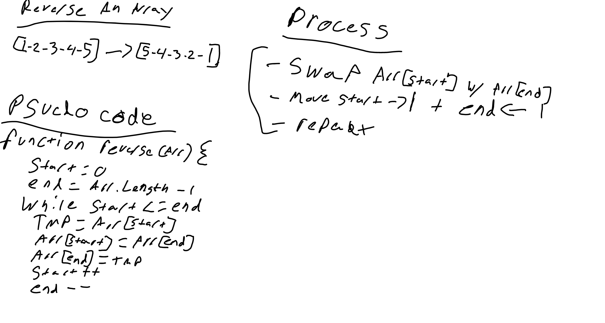

# Reverse an Array

Write a function that reverses an array, in place

Be careful of: empty arrays, arrays with only 1. add numbered count, even numbered count
<!-- Short summary or background information -->

## Challenge
<!-- Description of the challenge -->

## Approach & Efficiency
<!-- What approach did you take? Why? What is the Big O space/time for this approach? -->

-identify the start and end of the array (0 and length -1)
-swap the arr[start] with arr[end]
-move start forward by 1
-move end back by 1
-repeat while start <= end

## Solution
<!-- Embedded whiteboard image -->

