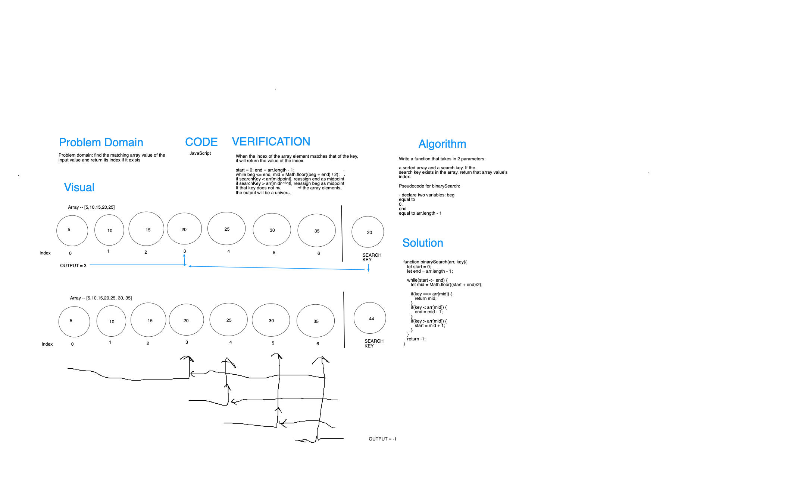

# Binary search in a sorted 1D array

## Challenge Summary
<!-- Short summary or background information -->
Write a function called BinarySearch which takes in 2 parameters: a sorted array and the search key. Without utilizing any of the built-in methods available to your language, return the index of the array’s element that is equal to the search key, or -1 if the element does not exist.

## Challenge Description
<!-- Description of the challenge -->

## Approach & Efficiency
<!-- What approach did you take? Why? What is the Big O space/time for this approach? -->
declared function binarySearch, passed in an array and search key. Iterate over array, if search key present, return the index where found. If search key not present, return the value -1. Tested to make sure array with key inclusion, key exclusion, and confirmed that input array does not contain an object.

## Solution
<!-- Embedded whiteboard image -->

