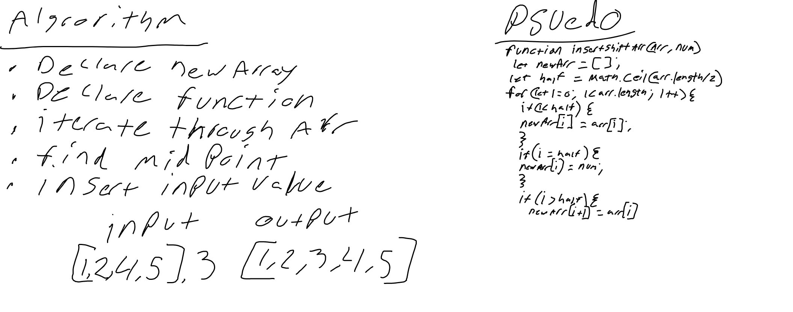

# Insert and shift middle index of array

## Challenge Summary
<!-- Short summary or background information -->
Write a function called insertShiftArray which takes in an array and the value to be added. Without utilizing any of the built-in methods available to your language, return an array with the new value added at the middle index.

## Challenge Description
<!-- Description of the challenge -->

## Approach & Efficiency
<!-- What approach did you take? Why? What is the Big O space/time for this approach? -->
declared a function that iterated thru an array, inserted the same value into new array for the first half, inserted the given value at the midpoint, and added the rest of the original array after the given value insertion.

## Solution
<!-- Embedded whiteboard image -->

